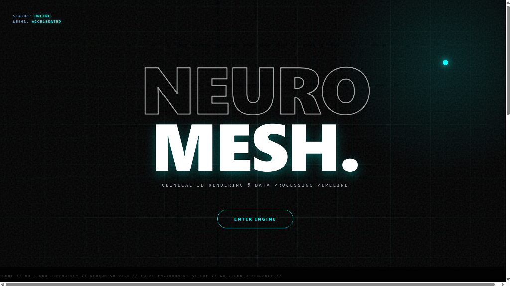
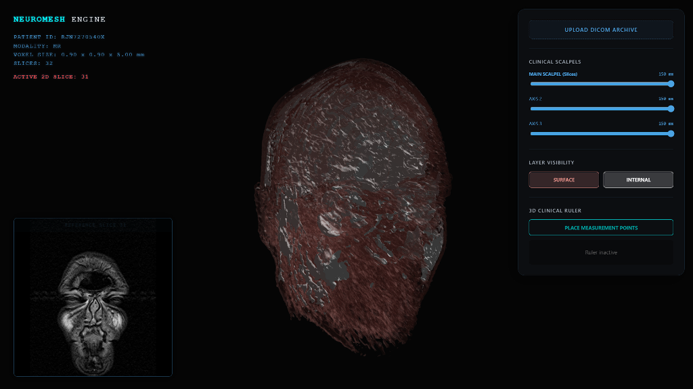
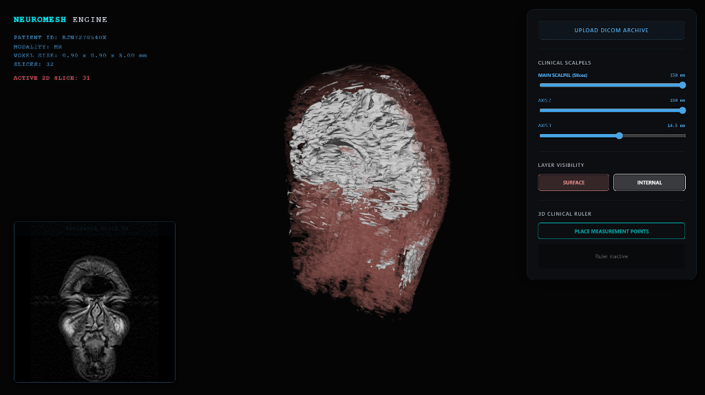
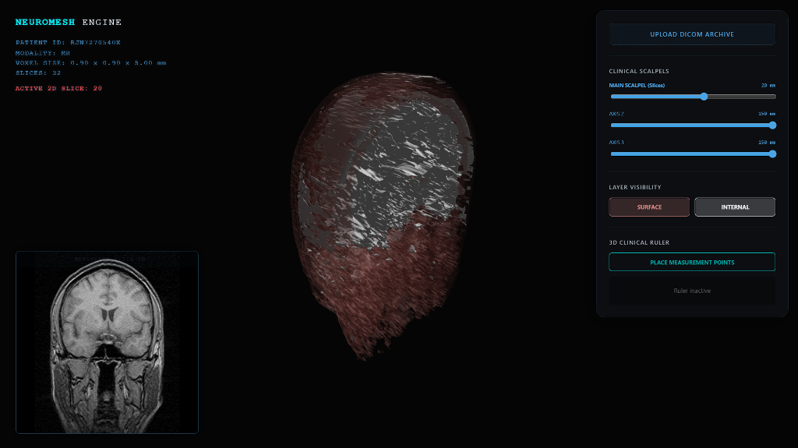
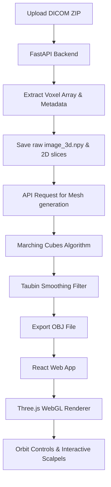

# NeuroMesh 🧠

An industry-grade medical 3D visualization engine that converts 2D DICOM MRI scans into interactive 3D meshes locally. 

<div align="center">
  
</div>

---

## ⚡ Quick Navigation
- [Interactive Showcase](#-interactive-showcase)
- [Key Features](#-key-features)
- [System Architecture](#%EF%B8%8F-system-architecture)
- [Tech Stack](#-tech-stack)
- [Quick Start Guide](#-quick-start-guide)
  - [Prerequisites](#prerequisites)
  - [Auto Startup](#auto-startup-recommended)
  - [Manual Setup](#manual-setup)
- [Clinical UI & Controls](#-clinical-ui--controls)
- [Lead Developer](#-lead-developer)

---

## 📸 Interactive Showcase

Compare the rendering layers and cross-section clinical scalpels in action:

| **01. Outer Surface Reconstruction** | **02. Inner Structure Segmentation** | **03. Real-Time Cross-Sectioning** |
|:---:|:---:|:---:|
|  |  |  |
| Semi-transparent outer skin mapping | Deep tissue segmentation (Marching Cubes) | Z-axis clipping plane (Scalpel) at 28mm |

---

## 🧠 Key Features

- **Dynamic Isosurface Extraction:** Real-time generation of 3D geometry from 2D voxel arrays using **Marching Cubes**. Allows adjusting tissue density to transition between skin surface, brain tissue, and bone structures.
- **Taubin Geometry Smoothing:** Removes jagged voxel-stepping artifacts using an advanced, non-shrinking 3D smoothing algorithm (Taubin filter), yielding clinical-grade organic surfaces.
- **Omnidirectional Scalpels:** Three independent clipping planes mapped to X, Y, and Z axes, facilitating real-time cross-sectioning and internal anatomical investigation.
- **WebGL Local Acceleration:** Render over 400,000 polygons at a smooth 60 FPS directly in the browser via Three.js. Operates fully offline without cloud dependencies.
- **3D Clinical Ruler:** Interactive canvas tool allowing users to place measurement nodes on the 3D reconstructed model and calculate precise physical distances in millimeters (mm).
- **Synchronized 2D Picture-in-Picture (PiP):** Dynamic 2D reference slice updates in real time based on the active clipping depth of the main 3D scalpel.

---

## ⚙️ System Architecture

NeuroMesh uses a decoupled architecture with a high-performance mathematical engine in Python and a highly-responsive WebGL renderer in React.



---

## 🛠️ Tech Stack

### Backend
- **Python**: Core programming language.
- **FastAPI**: High-performance web API framework.
- **Pydicom**: Reading and processing DICOM medical imaging metadata.
- **Scikit-Image**: Marching Cubes algorithm for isosurface generation.
- **Trimesh**: Taubin smoothing and 3D mesh processing.
- **NumPy**: Multidimensional array processing of 3D voxel grids.

### Frontend
- **React** (Vite): Component-based UI development with lightning-fast build cycles.
- **Three.js**: WebGL 3D graphics rendering library.
- **Framer Motion**: Smooth entry animations and interactive micro-interactions.

---

## 🚀 Quick Start Guide

### Prerequisites
- **Python 3.10+**
- **Node.js v16+**

### Auto Startup (Recommended)
Simply run the included batch script in the root directory to ignite both the FastAPI backend and React frontend simultaneously:
```bash
# Double-click the file or run it via terminal:
./start_engine.bat
```

---

### Manual Setup

#### 1. Backend Setup
1. Create a Python virtual environment:
   ```bash
   python -m venv venv
   source venv/bin/activate  # On Windows: venv\Scripts\activate
   ```
2. Install dependencies:
   ```bash
   pip install -r backend/requirements.txt
   ```
3. Run the FastAPI development server:
   ```bash
   cd backend
   uvicorn main:app --reload
   ```
   *The backend will run on `http://127.0.0.1:8000`.*

#### 2. Frontend Setup
1. Install node dependencies:
   ```bash
   cd frontend
   npm install
   ```
2. Start the Vite development server:
   ```bash
   npm run dev
   ```
   *The frontend will run on `http://localhost:5173`.*

---

## 🕹️ Clinical UI & Controls

1. **Upload DICOM Archive:** Pack a folder of DICOM files (`.dcm`) into a `.zip` archive and upload it using the frontend control panel.
2. **Interactive Scalpels:** Use the range sliders to clip the X, Y, and Z planes. Inspect inner brain cavities and skull matrices.
3. **Layer Visibility:** Toggle between the **Surface** skin layer (semi-transparent pink) and the **Internal** brain layer (opaque white) to view nested structures.
4. **Clinical Ruler:**
   - Click **Place Measurement Points**.
   - Click on any active 3D mesh surface to drop Point 1.
   - Click again to drop Point 2.
   - The engine automatically draws a vector line and outputs the precise physical spacing in millimeters.
5. **Reference Slice View:** As you move the main clinical scalpel, watch the bottom-left PiP window dynamically fetch the matching 2D DICOM slice for clinical reference.

---

## 👤 Lead Developer

**Sasmit Mondal**
*Computer Science & Engineering Student | High-Performance Applications & 3D Graphics*

<div align="left">
  <a href="https://github.com/sasmit-1">
    
  </a>
  <a href="https://www.linkedin.com/in/sasmit-mondal-361229390/">
    
  </a>
</div>